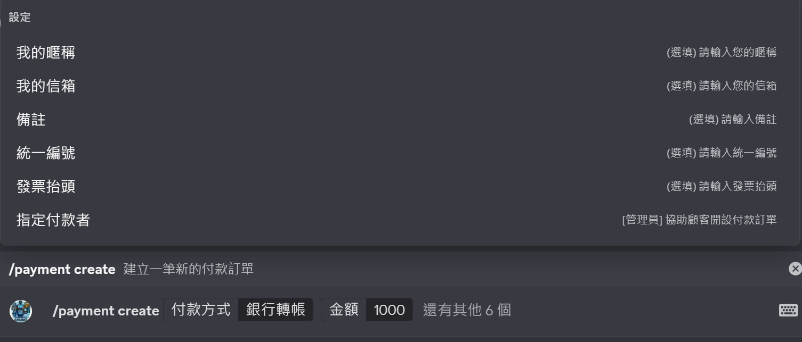
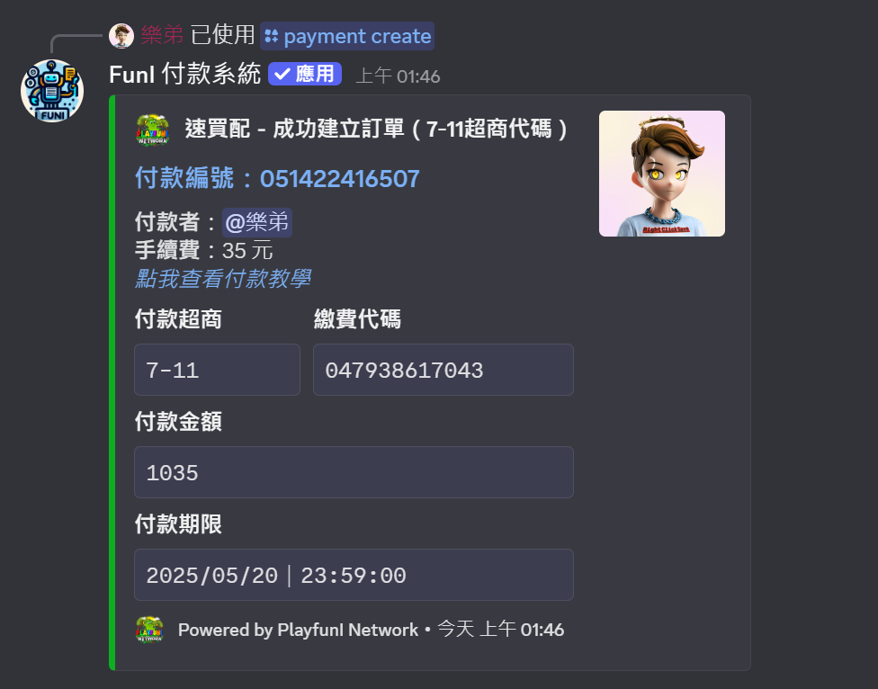
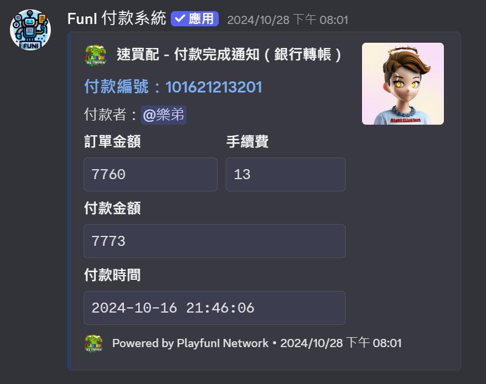

# /payment create

## 建立付款訂單 (payment create)

### 指令概述

`/payment create` 是 FunI 付款系統的核心功能，用於建立一筆新的付款訂單。此指令讓使用者可以以 「個人名義」 建立訂單，自行輸入訂單金額、付款方式或備註等相關資料。

<figure><figcaption></figcaption></figure>

### 使用權限

* **一般用戶**：若伺服器管理員未特別設定，所有用戶皆可使用此指令
* **受限用戶**：若伺服器啟用了權限控制，則僅有特定身分組的用戶可以使用


註：多數商城將此指令設為**受限用戶**，因指令 [/fp](fp.md) 可更佳快速建立訂單並讓用戶選擇付款方式


### 指令參數

<table><thead><tr><th width="234.53338623046875">參數</th><th>說明</th></tr></thead><tbody><tr><td><code>method</code></td><td><strong>付款方式</strong>：選擇希望使用的付款方式</td></tr><tr><td><code>amount</code></td><td><strong>金額</strong>：建立的訂單金額（此金額<strong>不包含</strong>手續費）</td></tr><tr><td><code>buyer</code></td><td><strong>(選填) 我的暱稱</strong>：買家的暱稱</td></tr><tr><td><code>mail</code></td><td><strong>(選填) 我的信箱</strong>：買家的信箱</td></tr><tr><td><code>comment</code></td><td><strong>(選填) 訂單備註</strong>：其他備註</td></tr><tr><td><code>invoice_number</code></td><td><strong>(選填) 統一編號</strong>：買家公司之統一編號</td></tr><tr><td><code>invoice_title</code></td><td><strong>(選填) 發票抬頭</strong>：買家公司之發票抬頭</td></tr><tr><td><code>designated</code></td><td><strong>(選填) 指定付款者</strong>：管理員限定功能，能將此筆訂單直接指定給某位成員</td></tr></tbody></table>

### 付款方式說明

目前系統支援以下付款方式（由速買配提供），各方式均有不同的手續費：

1. **銀行轉帳**
   * 透過 ATM 轉帳或網路銀行轉帳
   * 預設手續費：13元
2. **四大超商條碼繳費**
   * 支援 7-11、全家、萊爾富、OK 超商
   * 預設手續費：25元
3. **7-11 ibon 代碼繳費**
   * 使用 ibon 機台繳費
   * 預設手續費：30元
   * 超過 1000 元將額外收取 5 元手續費（可調整）
4. **全家 FamiPort 代碼繳費**
   * 使用 FamiPort 機台繳費
   * 預設手續費：35元
5. **萊爾富 Life-ET 代碼繳費**
   * 使用 Life-ET 機台繳費
   * 預設手續費：30元
   * 超過 1000 元將額外收取 5 元手續費（可調整）


實際手續費可自行至 [伺服器設定](broken-reference) 調整，預設值為速買配標定金額


### 建立付款訂單後

系統會根據您選擇的付款方式，提供相應的付款資訊：

* **銀行轉帳**：銀行代碼、銀行帳號
* **超商條碼**：三組條碼圖片
* **超商代碼**：對應的繳費代碼

此訊息會顯示於使用指令的頻道、買家的私人訊息、伺服器日誌logs

<figure><figcaption></figcaption></figure>

### 買家完成付款後

系統將在訂單付款後發送完成通知，資訊包括訂單編號、付款金額及時間等\
此訊息會顯示於當初使用指令的頻道、買家的私人訊息、伺服器日誌logs

<figure><figcaption></figcaption></figure>

### 根據訂單狀態自動命名/移動頻道

你可以至 [伺服器設定](broken-reference) 調整訂單的自動命名及移動分類相關功能\
訂單一共分為四種狀態：

* ~~選擇中 - 此指令不會出現該狀態~~
* **待付款** - 訂單一經建立即標示為待付款
* **已付款** - 買家完成付款後標示為已付款
* **已過期** - 買家未於指定時間內付款標示為已過期

### 相關指令

* [`/payment review`：查詢訂單付款狀態](payment-review.md)
* &#x20;[`/payment history`：查看歷史付款紀錄](payment-history.md)
* &#x20;[`/payment recheck`：管理員重新檢查付款狀態](payment-recheck.md)
* &#x20;[`/fp`：管理員快速建立付款單](fp.md)
