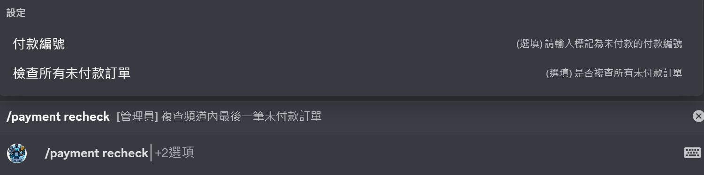
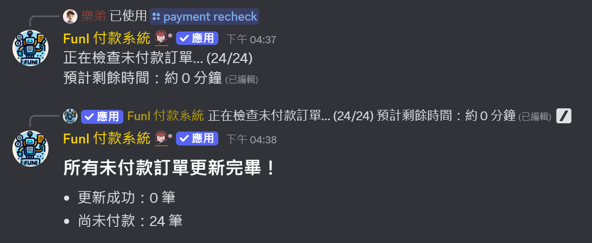

---
layout:
  title:
    visible: true
  description:
    visible: false
  tableOfContents:
    visible: true
  outline:
    visible: true
  pagination:
    visible: true
---

# /payment recheck

## 重新檢查付款狀態 (payment recheck)

### 指令概述

`/payment recheck` 可以讓管理員主動向速買配官方重新查詢付款訂單的狀態。此指令在機器人狀態異常或服務中斷後特別有用，因可能漏接來自官方的訂單完成通知。

<figure><figcaption></figcaption></figure>

### 使用權限

* **僅限管理員使用**：此指令只能由具有 「付款管理員身分組」 的用戶使用

### 指令參數

<table><thead><tr><th width="167.06671142578125">參數</th><th>說明</th></tr></thead><tbody><tr><td><code>smilepay_id</code></td><td><strong>(選填) 付款編號</strong>：要檢查的付款訂單編號，若無提供則將檢查該頻道中最後一筆未付款訂單</td></tr><tr><td><code>scan_all</code></td><td><strong>(選填) 複查所有未付款訂單</strong>：是否檢查伺服器內所有未付款訂單</td></tr></tbody></table>


**重要**：`scan_all` (複查所有未付款訂單) 可能會導致系統短期對速買配 API 及 Discord 產生較多請求。請勿隨意使用此功能以免觸發速率限制


### 檢查結果說明

系統檢查後將返回以下幾種可能的結果：

<figure><figcaption>
訂單已付款
</figcaption></figure>

<figure><figcaption>
訂單未付款/不存在或已過期
</figcaption></figure>

#### 批量檢查結果

批量檢查會檢查伺服器內所有未付款訂單，機器人會陸續發送檢查資訊並更新訊息，全部完成後發送檢查的結果。

<figure><figcaption></figcaption></figure>

### 相關指令

* &#x20;[`/payment create：建立新的付款訂單`](payment-create.md)&#x20;
* &#x20;[`/payment review`：查詢訂單付款狀態](payment-review.md)
* &#x20;[`/payment history`：查看歷史付款紀錄](payment-history.md)
* &#x20;[`/fp`：管理員快速建立付款單](fp.md)
